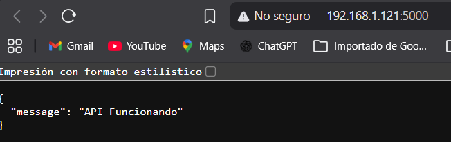
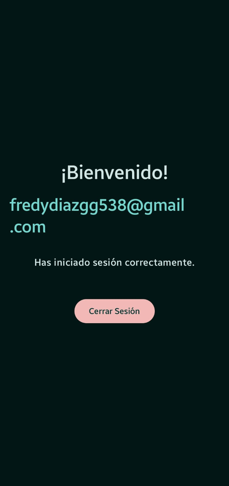
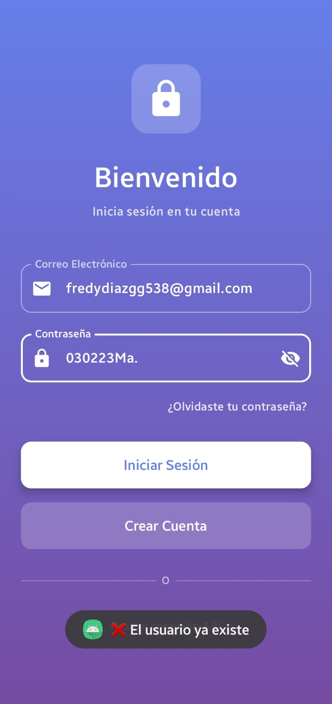
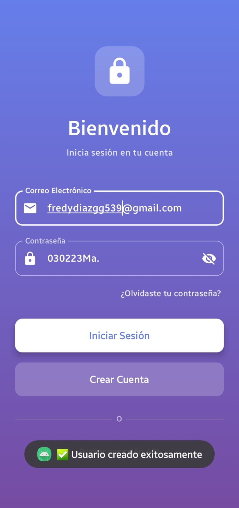
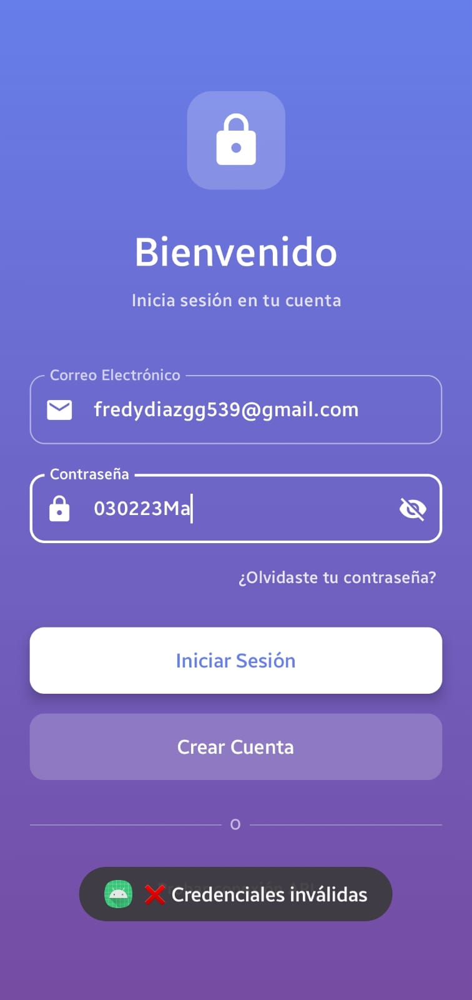
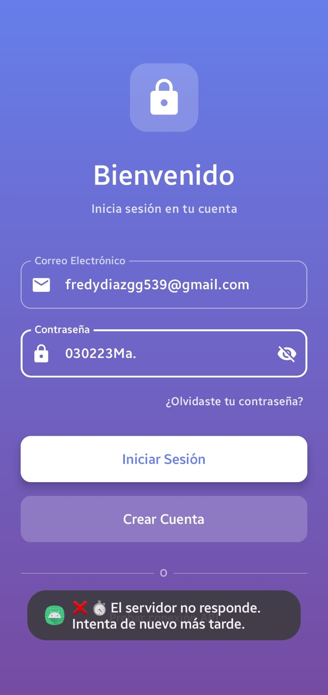

# Integración de API REST en Android 

Este proyecto es una aplicación nativa de Android desarrollada para demostrar el consumo de una API REST. Implementa la conexión a un servidor local, gestión de usuarios (registro e inicio de sesión) y el manejo de excepciones de red.

## Desarrollo de Ejercicios y Entregables

### Ejercicio 1 – Conexión y verificación de la API
Se configuró el cliente HTTP y se realizó una petición `GET` al endpoint raíz (`/`) al iniciar la aplicación. La respuesta del servidor se muestra en un `TextView` en la pantalla principal.

**Entregable:**
> Mensaje de respuesta de la API visible en el emulador.
**

### Ejercicio 2 – Pantalla de Registro
Se implementó una interfaz con campos para usuario y contraseña. Al procesar el botón de registro, se envía una petición `POST` con formato JSON al endpoint `/register`. 

**Entregables:**
> 1. Registro Exitoso:
**

> 2. Error por Usuario Duplicado:
**

### Ejercicio 3 – Pantalla de Login
Se creó la vista de inicio de sesión que envía una petición `POST` al endpoint `/login`. Cuenta con lógica de navegación mediante *Activities* o *Fragments* para redirigir al usuario según la respuesta del servidor.

**Entregables:**
> 1. Login Exitoso y navegación a la pantalla de bienvenida:
**

> 2. Login Fallido (credenciales incorrectas):
**

### Ejercicio 4 – Manejo de Errores de Red
Se implementó un bloque de captura de excepciones (`try-catch` o manejadores de error del cliente HTTP) para evitar cierres abruptos de la aplicación si el servidor deja de responder. 

Para esta prueba, se detuvo el contenedor del backend con `docker compose down` mientras la aplicación estaba en ejecución.

**Entregable:**
> Mensaje amigable al usuario indicando la caída de la red:
**

---

## Instrucciones de Ejecución
1. Levantar el servidor local ejecutando `docker compose up -d` en el directorio del backend.
2. Abrir el proyecto en Android Studio.
3. Sincronizar los archivos de Gradle.
4. Ejecutar la aplicación en un emulador con API 24 o superior.
